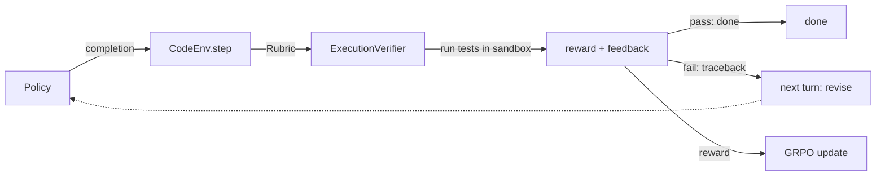

# A Decoupled, Multi-Turn Code-RL Environment (with a GRPO client)

A small but complete **reinforcement-learning environment for code generation**, and a
[GRPO](https://arxiv.org/abs/2402.03300) trainer built as a *client* of it. The environment
exposes a Gym-style `reset()` / `step()` interface, computes reward by executing unit tests,
supports a multi-turn *write → run tests → read the traceback → revise* loop, and is fully
**unit-tested without a GPU**.

The point of the design is separation of concerns: the environment knows *how a task is scored*;
it knows nothing about *how a policy is trained*. GRPO is one consumer of the environment;
evaluation is another. Any algorithm could be a third.

---

## Why an "environment" and not a training loop

A typical from-scratch GRPO script fuses three things into one loop: sampling tasks, computing
the unit-test reward, and applying the policy update. That works, but it can't be tested without
a GPU, the reward can't be reused by other algorithms, and it can't be made multi-turn. This
repo factors those apart:

| Layer | Module | Responsibility |
|---|---|---|
| Task | `code_rl_env/tasks.py` | `TaskSpec` + MBPP / HumanEval loaders → one task shape |
| Sandbox | `code_rl_env/sandbox.py` | run code in a timed subprocess (never hangs the trainer) |
| Verifier | `code_rl_env/verifier.py` | `ExecutionVerifier` → per-test pass/fail + error text |
| Rubric | `code_rl_env/rubric.py` | `Rubric` → weighted blend of named reward functions |
| Episode | `code_rl_env/episode.py` | `Turn` / `Trajectory` dataclasses |
| **Environment** | `code_rl_env/environment.py` | **`CodeEnv` → Gym-style `reset()`/`step()`, multi-turn** |
| Trainer (client) | `train_grpo.py` | rolls out trajectories, consumes the env's reward |

The environment deals only in **text** (prompt in, completion out) and never imports
`torch`/`transformers`, so it stays model-agnostic and trivially testable.



---

## Quickstart

```bash
git clone https://github.com/sidd1196/GRPO_implementation.git
cd GRPO_implementation

# Install. The core env (and its tests) need only `datasets` — no GPU.
pip install -e .

# Prove the environment is correct, with no model and no GPU:
pytest -q tests/        # 12 tests: verifier scoring + multi-turn rollout protocol
```

Using the environment directly:

```python
from code_rl_env import CodeEnv, TaskSpec

task = TaskSpec(
    task_id="demo/double", prompt="Return x doubled.",
    tests=["assert f(2) == 4", "assert f(3) == 6"], entry_point="f", source="demo",
)
env = CodeEnv([task], max_turns=3)

obs = env.reset(task)
step = env.step("def f(x):\n    return x + 2")     # wrong -> reward < 1, not done
print(step.reward, step.done)                       # 0.5 False
print(step.observation.prompt_text)                 # shows the failing test, asks for a fix
step = env.step("def f(x):\n    return x * 2")      # corrected -> reward 1.0, done
print(step.reward, step.done, step.info["solved"])  # 1.0 True True
```

Reward composition is a swappable `Rubric` of weighted reward functions:

```python
from code_rl_env import default_rubric, dense_rubric
# default_rubric() -> tests only
# dense_rubric()   -> 0.8*tests + 0.1*syntax + 0.1*format(no markdown fences)
```

---

## The GRPO experiment

`train_grpo.py` is the GPU part — GRPO as a client of `CodeEnv`. For each step it rolls out
`G` multi-turn trajectories on one task (a GRPO group), asks the environment for each
trajectory's reward, group-normalises the rewards into advantages, and takes a clipped
policy-gradient step. One loop runs two configs via `GRPOConfig`:

- **GRPO baseline** — KL to a frozen reference, symmetric clip ε = 0.2.
- **MicroCoder-GRPO** ([arxiv 2603.07777](https://arxiv.org/abs/2603.07777)) — three
  code-specific fixes: no-KL + high upper clip (Fix 3), two-stage temperature (Fix 2), and
  truncation masking (Fix 1).

```python
from code_rl_env import load_mbpp, load_humaneval, default_rubric
from train_grpo import GRPOConfig, run_grpo, evaluate

train_tasks = load_mbpp(limit=150)
cfg = GRPOConfig(microcoder=True, num_steps=200, G=4, max_turns=3,
                 kl_coeff=0.0, epsilon_high=0.5)
log = run_grpo(policy, tokenizer, train_tasks, cfg, rubric=default_rubric())

# evaluate() reports pass@1 for in-distribution (MBPP) AND transfer (HumanEval)
evaluate(policy, tokenizer, load_humaneval(), default_rubric())["pass@1"]
```

Evaluation deliberately reports **both** held-out MBPP (in-distribution — where the policy is
trained) and HumanEval (transfer). Reporting only the transfer number is what made an earlier
version of this experiment look like RL *hurt*; separating the two gives an honest answer to
"did the policy learn the trained distribution, and did it generalise?"

> **Status:** the environment, verifier, rubric and rollout protocol are unit-tested and
> green. The multi-turn GRPO training itself runs on a Colab A100 (model: Qwen2.5-Coder-1.5B
> + LoRA); result tables are produced by running the driver notebook below. Single seed,
> small model, 200 steps, coarse 3-test MBPP reward — this is a clean reference implementation,
> not a leaderboard entry.

---

## Running on Colab

`grpo_rlvr_dapo_code.ipynb` is a **teaching driver**: open it from GitHub in Colab
(*File → Open notebook → GitHub*), and it clones this repo, installs the package, then walks
through each layer of the environment with explanations before training and evaluating.

---

## Repository contents

```
GRPO_implementation/
├── code_rl_env/                 # the RL environment package (no GPU needed to import/test)
│   ├── tasks.py  sandbox.py  verifier.py  rubric.py  episode.py  environment.py
├── tests/                       # 12 GPU-free unit tests
├── train_grpo.py                # GRPO/MicroCoder-GRPO trainer + evaluator (env client)
├── grpo_rlvr_dapo_code.ipynb    # teaching driver notebook (Colab)
├── grpo_rlvr_dapo_inline_v1.ipynb  # earlier inline implementation, kept as a results record
├── grpo_implementation.ipynb    # toy GRPO walkthrough (sorting task) — pedagogical origin
├── git_process_rewards.py       # process-reward modeling: dense rewards over git-commit steps
├── grpo_rft_code/               # production-stack variant (TRL GRPOTrainer + vLLM + YAML configs)
├── build_driver_notebook.py     # regenerates the driver notebook
├── pyproject.toml  requirements.txt
```

- **`git_process_rewards.py`** — a standalone exploration of *process supervision*: instead of a
  single pass/fail reward, it assigns dense, intermediate rewards (syntax, diff validity,
  incremental test passing) across a sequence of git commits modelled as an MDP.
- **`grpo_rft_code/`** — the same experiment expressed on the production post-training stack
  (TRL `GRPOTrainer`, PEFT LoRA, vLLM, YAML configs) rather than a hand-rolled loop. Scaffolded
  for a config-driven "reinforcement fine-tuning" workflow.

---

## References

- **GRPO** — DeepSeekMath: Pushing the Limits of Mathematical Reasoning (2024)
- **DAPO** — an open-source LLM RL recipe (2025): dynamic sampling, decoupled clipping
- **MicroCoder-GRPO** — code-specific GRPO fixes (arxiv 2603.07777)
- **PPO** — Proximal Policy Optimization Algorithms (Schulman et al., 2017)

## License

Educational reference implementation.
