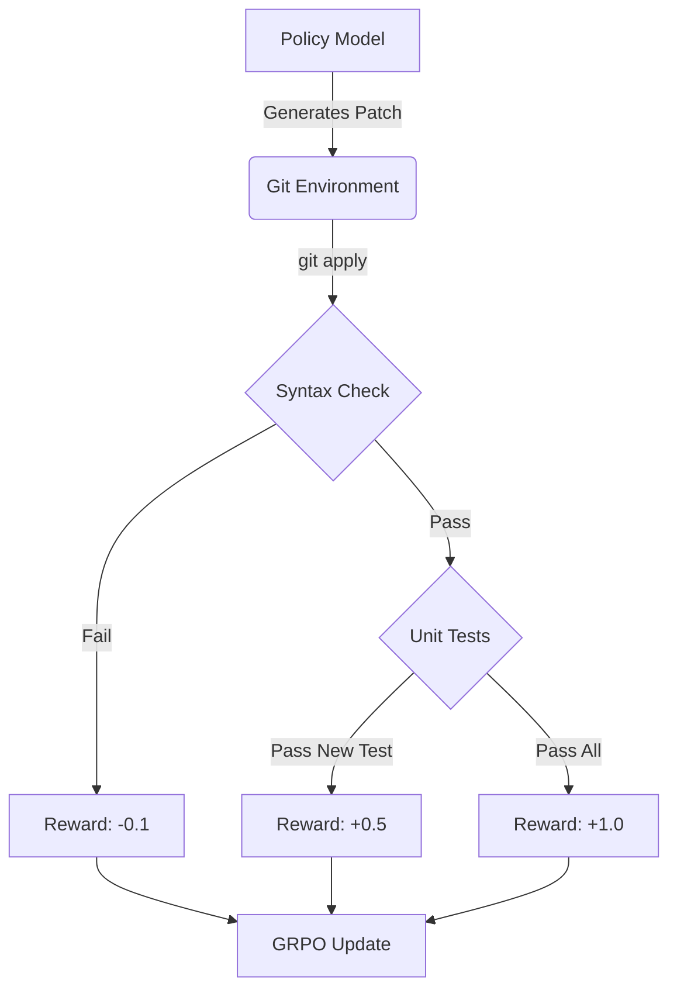

# Git-RL: Process Reward Modeling for Code Generation

A reference implementation of Process Supervision (PRM) for Coding Agents. Instead of optimizing for binary pass/fail (Outcome Reward), this loop optimizes for 'Git-Commit' trajectories using Group Relative Policy Optimization (GRPO).

## Overview

Traditional reinforcement learning for code generation suffers from sparse rewards - the model only receives feedback at the very end when code either passes or fails all tests. This makes training inefficient and unstable. Process Reward Modeling addresses this by providing dense, intermediate rewards at each step of the coding process, treating each Git commit as a state in a Markov Decision Process (MDP).

This implementation demonstrates how to:
- Model coding trajectories as sequences of Git commits
- Provide dense rewards for syntax validation, diff application, and incremental test passing
- Use GRPO to stabilize training on long-horizon reasoning traces
- Leverage infrastructure optimizations for low-latency evaluation

## Key Features

- **Dense Rewards:** Implements intermediate rewards for Syntax, Diff Application, and Incremental Test Passing
- **Commit-as-State:** Models the coding process as a Markov Decision Process (MDP) where every commit is a state transition
- **GRPO Integration:** Uses Group Relative Policy Optimization to stabilize the training on these long-horizon reasoning traces
- **Token-Level Advantages:** Assigns step-specific rewards to tokens generated in that commit step, enabling fine-grained credit assignment
- **Multi-Turn Generation:** Supports multi-turn code generation where each turn represents a Git commit
- **Infrastructure Ready:** Includes `infrastructure_mock.py` demonstrating the Firecracker Snapshot architecture for low-latency evaluation

## Architecture



## Installation

### Requirements

- Python 3.8+
- PyTorch 1.9+ (with CUDA support recommended)
- einops
- matplotlib
- tqdm

### Install Dependencies

```bash
pip install torch einops matplotlib tqdm
```

Or using the requirements file:

```bash
pip install -r requirements.txt
```

## Project Structure

```
GRPO_implementation/
│
├── grpo_implementation.py          # Main GRPO implementation with multi-turn support
├── git_process_rewards.py          # Process reward modeling for Git commits
├── infrastructure_mock.py          # Firecracker VM orchestration mock
├── grpo_implementation.ipynb       # Jupyter notebook for experimentation
├── README.md                       # This file
└── requirements.txt                # Python dependencies
```

## Usage

### Process Reward Modeling

The `GitProcessReward` class calculates dense rewards for coding trajectories:

```python
from git_process_rewards import GitProcessReward

reward_calculator = GitProcessReward()

# Simulate a sequence of Git commits
commits = [
    "def add(a, b):\n    return a + b",
    "def add(a, b):\n    return a + b\n\ndef subtract(a, b):\n    return a - b",
    "def add(a, b):\n    return a + b\n\ndef subtract(a, b):\n    return a - b\n\ndef multiply(a, b):\n    return a * b"
]

# Compute step rewards
rewards = reward_calculator.compute_step_rewards(commits)
print(rewards)  # [0.1, 0.8, 1.6] - dense rewards for each step
```

### Multi-Turn GRPO Training

The `GroupRelativePolicyOptimization` class supports multi-turn generation:

```python
from grpo_implementation import Model, GroupRelativePolicyOptimization
import torch

# Initialize model
model = Model(vocab_size=100, embedding_dim=64, prompt_length=10, response_length=10)
device = "cuda" if torch.cuda.is_available() else "cpu"
model = model.to(device)

# Initialize GRPO trainer
grpo = GroupRelativePolicyOptimization(
    model=model,
    num_turns=5,  # 5 commits per trajectory
    num_responses=10,  # 10 trajectories per prompt
    device=device
)

# Generate prompts
prompts = torch.randint(0, 100, (2, 10), device=device)

# Simulate rewards per step (from GitProcessReward)
rewards_per_step = torch.tensor([
    [[0.1, 0.3, 0.5, 0.8, 1.0], [0.1, 0.2, 0.4, 0.7, 0.9]],  # Batch 1, 2 trajectories
    [[0.1, 0.4, 0.6, 0.9, 1.1], [0.1, 0.3, 0.5, 0.8, 1.0]]   # Batch 2, 2 trajectories
], device=device)

# Train step
optimizer = torch.optim.Adam(model.parameters(), lr=1e-3)
loss = grpo.train_step(prompts, rewards_per_step, optimizer, loss_mode="clipped")
```

### Firecracker Infrastructure Mock

The `FirecrackerEvaluator` simulates low-latency VM-based evaluation:

```python
from infrastructure_mock import FirecrackerEvaluator

# Initialize evaluator with task snapshot
evaluator = FirecrackerEvaluator(task_id="sorting_task")

# Fork VM and evaluate code patch
code_patch = """
def sort_numbers(numbers):
    return sorted(numbers)
"""

result = evaluator.fork_and_evaluate(code_patch)
print(f"Syntax valid: {result['syntax_valid']}")
print(f"Latency: {result['latency_ms']:.2f}ms")
print(f"Test results: {result['test_results']}")
```

## Reward Structure

The process reward model provides four types of rewards:

1. **Syntactic Check (+0.1 or -0.1):** Validates Python syntax using `ast.parse()`. Invalid syntax immediately returns -0.1.

2. **Diff Validity (+0.2):** Checks if the commit applies cleanly to the previous state. Simulates merge conflict detection.

3. **Incremental Test Passing (+0.5):** Rewards passing new tests compared to the previous commit state. Encourages incremental progress.

4. **Final Completion (+1.0):** Large reward if the final state passes all tests. Provides strong signal for successful completion.

## Technical Details

### Token-Level Advantage Assignment

Instead of assigning the final reward to all tokens, this implementation assigns step-specific rewards to tokens generated in that commit step:

- Each commit step generates tokens
- Rewards from that step are assigned to those specific tokens
- This enables fine-grained credit assignment and faster learning

### Multi-Turn Generation

The `GroupRelativePolicyOptimization` class supports multi-turn generation:

- Each turn represents a Git commit
- State evolves across turns (each commit builds on previous)
- Rewards are computed per turn and assigned to tokens in that turn
- GRPO stabilizes training across multiple turns

### Firecracker Architecture

The infrastructure mock demonstrates:

- **Snapshot-based forking:** Load pre-warmed VM snapshots (~1ms vs Docker ~100ms)
- **Copy-on-Write (CoW):** Multiple VMs share base memory, only modified pages are copied
- **Shared memory injection:** Zero-copy code injection via shared memory
- **Fail-fast syntax check:** Early return for invalid syntax to avoid VM overhead

## Experiments

### Single-Turn Training

For simple tasks, use the original single-turn training:

```python
from grpo_implementation import run_policy_gradient, sort_inclusion_ordering_reward

image_path, log_path = run_policy_gradient(
    num_epochs=100,
    num_steps_per_epoch=10,
    num_responses=10,
    deltas_mode="centered_rewards",
    loss_mode="clipped",
    reward_fn=sort_inclusion_ordering_reward,
    use_cache=True,
    device="cuda"
)
```

### Multi-Turn Training

For complex coding tasks, use multi-turn GRPO:

```python
from grpo_implementation import Model, GroupRelativePolicyOptimization
from git_process_rewards import GitProcessReward

# Setup
model = Model(...)
grpo = GroupRelativePolicyOptimization(model, num_turns=5, num_responses=10)
reward_calc = GitProcessReward()

# Training loop
for epoch in range(num_epochs):
    # Generate multi-turn trajectories
    responses = grpo.generate_multi_turn_responses(prompts)
    
    # Compute process rewards
    rewards_per_step = []
    for batch in range(batch_size):
        commits = [decode_commit(r) for r in responses[batch, 0, :, :]]
        step_rewards = reward_calc.compute_step_rewards(commits)
        rewards_per_step.append(step_rewards)
    
    rewards_per_step = torch.tensor(rewards_per_step)
    
    # Train step
    loss = grpo.train_step(prompts, rewards_per_step, optimizer)
```

## Key Concepts

### Process Supervision

Process Supervision (PRM) provides intermediate feedback during code generation:

- Instead of sparse binary rewards (pass/fail), provides dense step-by-step rewards
- Makes the RL problem more tractable by reducing reward sparsity
- Enables faster learning through better credit assignment

### Commit-as-State MDP

Modeling Git commits as MDP states:

- Each commit is a state transition in the coding process
- Actions are code patches/diffs
- Rewards are computed at each commit step
- Policy learns to generate sequences of valid, incremental commits

### GRPO for Long-Horizon Reasoning

Group Relative Policy Optimization stabilizes training:

- Uses group structure (multiple responses per prompt) for natural baselines
- Reduces variance without requiring separate value function network
- Particularly effective for long-horizon reasoning tasks like code generation

## References

- **GRPO Paper:** Group Relative Policy Optimization (Yang et al., 2025)
- **PPO Paper:** Proximal Policy Optimization Algorithms (Schulman et al., 2017)
- **Process Reward Modeling:** Training Language Models to Follow Instructions with Human Feedback (OpenAI, 2022)
- **Firecracker:** Firecracker: Lightweight Virtualization for Serverless Applications (Amazon, 2018)

## Contributing

This is a reference implementation for educational purposes. Feel free to:
- Experiment with different reward structures
- Try alternative baseline strategies
- Extend to other sequence tasks
- Optimize for larger models and longer trajectories

## License

This implementation is for educational purposes. Please refer to the original papers and course materials for licensing information.

## Acknowledgments

- PyTorch team for excellent deep learning framework
- Firecracker project for VM orchestration architecture
- Research community for process supervision and GRPO methods

---

**Note:** This implementation demonstrates Process Reward Modeling for code generation. For production use, refer to the official papers and implementations.
