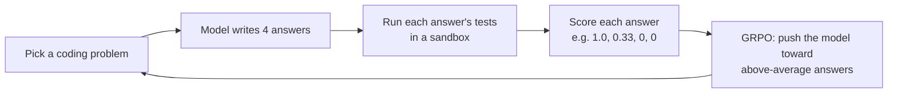

# GRPO for Code: a Small RL Environment, Two Training Methods, and Where the Time Goes

This repo teaches a small code model (**Qwen2.5-Coder-1.5B-Instruct**) to write better Python
functions using reinforcement learning (**GRPO**), and measures what the training loop spends
its time on.

It has three parts:

1. **An RL environment for code.** It hands the model a coding problem, runs the model's
   code against unit tests in a sandbox, and returns a score.
2. **A GRPO trainer.** It uses those scores to update the model. Two variants are compared:
   plain GRPO and MicroCoder-GRPO.
3. **Timing instrumentation.** Every training step records how long it spent generating,
   running tests, and training, so we can see where GPU time is wasted.

---

## Where things stand (Sept 2026)

- Full run completed on a Colab **G4** GPU: base model vs GRPO vs MicroCoder-GRPO,
  200 training steps each, single seed.
- Per-step timing recorded: **~80% of every step is generation**, ~10–13% is running
  tests (GPU idle), and only ~7–9% is training.
- Results, logs and plots are saved; the executed notebook is `grpo_run_results.ipynb`.
- **RL did not meaningfully improve accuracy at this scale.** The run is small (800
  rollouts in total), so the accuracy differences are within noise. The honest findings are
  about **how the loop behaves**, not about a better model. Details below.

---

## How it works

One training step, in plain words:


```mermaid
flowchart LR
    A[Pick a coding problem] --> B[Model writes 4 answers]
    B --> C[Run each answer's tests<br/>in a sandbox]
    C --> D[Score each answer<br/>e.g. 1.0, 0.33, 0, 0]
    D --> E[GRPO: push the model toward<br/>above-average answers]
    E --> A
```

- **Why 4 answers?** GRPO has no separate "critic" model. It judges each answer by comparing
  it to the other answers for the *same* problem. An answer that beats the group average
  gets reinforced; one below average gets discouraged.
- **Partial credit.** An answer that passes 1 of 3 tests scores 0.33, not 0. That gives the
  model something to learn from even when no answer is fully correct.
- **Multi-turn.** If an answer fails, the model sees its own code plus the failing test and
  error message, and gets up to 3 attempts in total.

---

## The code, file by file

The environment knows *how to score code*. It knows nothing about *how the model is
trained*. That separation means the environment can be tested without a GPU, and any
training method could use it.

| File | What it does |
|---|---|
| `code_rl_env/tasks.py` | Loads coding problems (MBPP, HumanEval) into one common format |
| `code_rl_env/sandbox.py` | Runs code in a separate process with a 5-second time limit |
| `code_rl_env/verifier.py` | Runs each test and reports pass/fail, the error, and whether it timed out |
| `code_rl_env/rubric.py` | Turns test results into a score (fraction of tests passed) |
| `code_rl_env/episode.py` | Small data classes that record each turn of an attempt |
| `code_rl_env/environment.py` | The environment: `reset()` gives a problem, `step(code)` scores it |
| `train_grpo.py` | The GRPO trainer, the timing instrumentation, and evaluation |
| `tests/` | 12 unit tests for the environment. They run without a GPU. |
| `grpo_rlvr_dapo_code.ipynb` | The notebook that runs everything on Colab |

---

## The experiment

Both methods train the same model with LoRA (a small set of extra trainable weights) for
200 steps. Each step uses one problem and 4 answers, with up to 3 attempts per answer.

| | GRPO (baseline) | MicroCoder-GRPO |
|---|---|---|
| Stay close to the original model (KL penalty) | yes (0.01) | no |
| Sampling temperature | 0.8 fixed | 0.7, then 1.0 from step 100 |
| Don't punish answers cut off at the length limit | no | yes (30% of the time) |
| Allow larger updates (upper clip) | 0.2 | 0.5 |

MicroCoder-GRPO comes from [arXiv 2603.07777](https://arxiv.org/abs/2603.07777).

**An honest caveat:** in this run, two of MicroCoder's three fixes had almost no effect.

- **The larger upper clip never applies.** The "old" log-probs come from the same forward
  pass as the new ones, detached, not from the generator. So the importance ratio is exactly
  1 by construction, and a clip on it does nothing. With one gradient step per batch this is
  fine in practice. But measured properly, the ratio wouldn't be exactly 1 even here: answers
  are sampled at temperature 0.8 (GRPO; MicroCoder uses 0.7, then 1.0) while log-probs are
  scored at temperature 1, and batched KV-cache generation and a single full forward pass
  don't produce bit-identical log-probs. A real "old policy" should be the generator's own
  log-probs, at the sampling temperature.
- **Truncation masking rarely triggers.** Only ~3–4% of answers hit the 256-token limit.

So the real difference between the two runs is **temperature schedule + KL on/off**.

**Evaluation.** After training, each model answers every problem once, greedily (no
randomness). **pass@1** is the fraction solved on that first try. We measure two things:

- **MBPP held-out (30 problems):** same kind of problems as training.
- **HumanEval (164 problems):** different problems, to see if the skill transfers.

---

## Results

| Model | MBPP (30) | HumanEval (164) |
|---|---|---|
| Base (no training) | 0.667 (20) | 0.567 (93) |
| GRPO | 0.700 (21) | 0.537 (88) |
| MicroCoder-GRPO | 0.667 (20) | 0.561 (92) |

**Paired comparison:** on how many problems did one method succeed where the other failed?

| | Only GRPO solved | Only MicroCoder solved |
|---|---|---|
| MBPP | 1 | 0 |
| HumanEval | 1 | 5 |

**What this does and doesn't show:**

- **Neither method clearly beats the base model.** GRPO's MBPP gain is 1 problem out of 30,
  which is noise.
- On HumanEval, GRPO lost 5 problems compared with the base model; MicroCoder lost 1.
- The paired 5-vs-1 points the same way as an earlier run with a different evaluation setup
  (5-vs-0), but it is **not statistically significant** (sign test, p ≈ 0.22). Treat it as a direction, not proof.
- **Why so little change:** only 800 rollouts in total, low-rank LoRA with a small learning
  rate, and many steps where all 4 answers scored the same (see below). The mid-training
  MBPP evaluation stayed between 0.633 and 0.700, which shows the model barely moved.
- **Absolute numbers aren't comparable to the official leaderboard.** Qwen reports HumanEval
  70.7 / MBPP 69.2 for this model
  ([Qwen2.5-Coder report](https://arxiv.org/abs/2409.12186)). This repo uses its own prompt
  and grading, and a 30-problem MBPP subset. Only comparisons *within* this repo are valid.

---

## Where the time goes

Every step does three things, one after another. Nothing overlaps.

```
 one training step (~6 s)
 |========== generate 4 answers (4.7-4.9 s) ==========|-- tests --|- train -|
                    GPU busy                            GPU idle    GPU busy
```

Mean seconds per step (step 0 excluded because it includes warm-up):

| Phase | GRPO | MicroCoder | Share of step |
|---|---|---|---|
| Generate answers | 4.71 s | 4.90 s | ~80% |
| Run tests (GPU idle) | 0.61 s | 0.82 s | ~10–13% |
| Train (forward + backward + update) | 0.52 s | 0.42 s | ~7–9% |
| Weight sync | 0 | 0 | — |
| **Total** | **5.83 s** | **6.14 s** | |

Weight sync is 0 because generation and training use the same model object, so there's
nothing to copy.

**How this compares to published numbers.** [RollPacker (2025)](https://arxiv.org/abs/2509.21009)
measured synchronous GRPO on a code task with a 14B model on 32 H800 GPUs:

| | RollPacker (14B, code) | This repo (1.5B, one G4) |
|---|---|---|
| Generation | 66% | ~80% |
| Running tests | 13% | 10–13% |
| Training | 21% | ~7–9% |

The shape is the same: **generation dominates**. The test share matches closely. Our
generation share is higher because we use plain Hugging Face `generate` rather than a fast
inference engine. Our training share is lower because LoRA on a 1.5B model is cheap to
train.

**What it means.** Training is only ~8% of the step, so simply running training in parallel
with generation would save at most ~8%. The bigger wins are:

1. **Faster generation:** a dedicated inference engine (e.g. vLLM) with continuous batching.
2. **Overlap the idle time:** keep generating while the tests for earlier answers run.
3. **Asynchronous training:** a separate generator that never waits for the trainer.

Step 3 creates a new problem: the generator works with weights that are a few updates old.
The importance ratio is then no longer 1, so the loop would need:

- the generator's own log-probabilities as the "old policy" values,
- per-token importance ratios (the current code uses a per-sequence average),
- a limit on how stale the data may get,
- a correction for short answers finishing first and being over-represented in batches.

---

## What broke: the learning signal ran out

We checked whether answers were **cut off at the length limit** or **timing out** in the
sandbox. Neither was the problem:

| | GRPO | MicroCoder |
|---|---|---|
| Answers cut off at 256 tokens | 2.6% | 4.1% |
| Answers whose tests timed out | 0% | 0.2% |
| Average answer length (tokens) | 76 | 80 |

**What we saw instead:** at several logged checkpoints, the loss was exactly 0, with a group
reward of 1.00 (all 4 answers passed) or 0.00 (all 4 failed). When every answer gets the
same score, every answer is exactly average, so the step teaches the model nothing. On
problems that are too easy or too hard for the model, the learning signal disappears.

**How often:** in **[X]%** of GRPO steps and **[Y]%** of MicroCoder steps, all 4 answers got
the same score (group reward std = 0), so the step produced no learning signal.

**Why it's this high — partly by design.** Each answer gets up to 3 attempts, and there is
no penalty for using them: a fix on attempt 3 scores 1.0, exactly like a first-try solve.
The base model already solves about two-thirds of the problems, so with three attempts most
answers reach 1.0 and the whole group ties. Multi-turn without a turn cost creates
zero-signal groups.

**Fixes:** (1) a small per-turn cost, so a first-try solve beats a third-try solve;
(2) DAPO's dynamic sampling: skip or resample problems where all answers scored the same;
(3) harder training problems.

**About truncation masking** (MicroCoder's Fix 1): cut-off code can't run, so it scores 0.
That teaches the model to write short answers instead of correct ones. Masking skips some of
those penalties. It costs lost training signal, the 30% skip rate is a heuristic, and it
doesn't recover the time already spent generating the long answer. In this run it barely
mattered, because almost nothing was cut off.

---

## How to run it

**The environment's unit tests (no GPU, a few seconds):**

```bash
git clone https://github.com/sidd1196/GRPO_implementation.git
cd GRPO_implementation
pip install -e ".[dev]"
pytest -q tests/        # 12 tests
```

**The full experiment (Colab):**

1. Open the notebook in Colab:
   `https://colab.research.google.com/github/sidd1196/GRPO_implementation/blob/main/grpo_rlvr_dapo_code.ipynb`
2. **Runtime → Change runtime type** → a GPU with bf16 support (L4, G4 or A100; not T4).
3. Run all cells. When asked, allow Google Drive access. Results are saved to
   `MyDrive/GRPO_implementation/results/`.

What gets saved:

| File | Contents |
|---|---|
| `base.json`, `grpo.json`, `micro.json` | accuracies, which problems passed, the code written, full training log with timings |
| `summary.txt` | accuracy table, paired comparison, timing |
| `timing.png` | where each step's time goes |
| `training_curves.png` | reward, solve rate, answer length, truncation rate over training |

Training takes ~6 s per step on a G4 (~20 minutes per method). Evaluation adds more,
because it solves one problem at a time.

**Using the environment directly:**

```python
from code_rl_env import CodeEnv, TaskSpec

task = TaskSpec(task_id="demo/double", prompt="Return x doubled.",
                tests=["assert f(2) == 4", "assert f(3) == 6"],
                entry_point="f", source="demo")
env = CodeEnv([task], max_turns=3)

env.reset(task)
step = env.step("def f(x):\n    return x + 2")   # passes 1 of 2 tests
print(step.reward, step.done)                     # 0.5 False
step = env.step("def f(x):\n    return x * 2")    # fixed
print(step.reward, step.done)                     # 1.0 True
```

---

## Limitations

- **Small scale:** 1.5B model, LoRA rank 8, 200 steps × 4 answers, one GPU.
- **Single seed:** no error bars; small differences are noise.
- **Small MBPP eval set:** 30 problems, so one problem = 3.3 points.
- **No inference engine in the run:** generation uses Hugging Face `generate`. A vLLM backend
  exists in `train_grpo.py` (with per-step weight sync) but was not used or tested here.
- **Synchronous loop:** asynchronous training is discussed above, not implemented.
- **No turn cost:** a third-try solve is rewarded the same as a first-try solve.

## Next steps

1. Add a per-turn cost and DAPO dynamic sampling; rerun and compare the zero-signal share.
2. Batch the evaluation (currently one problem at a time, about half of total runtime).
3. Per-token importance ratios, then an asynchronous generator with a staleness limit.
4. More seeds and more steps before claiming any accuracy difference.

---

## Other files in the repo

These are earlier or side projects, not part of the current run:

| File | What it is |
|---|---|
| `grpo_run_results.ipynb` | The executed notebook from the run above, with all outputs |
| `grpo_rlvr_dapo_inline_v1.ipynb` | An earlier all-in-one version of this experiment (June 2026) |
| `grpo_implementation.ipynb` | A toy GRPO walkthrough on a sorting task |
| `grpo_rft_code/` | A sketch of the same experiment on TRL's `GRPOTrainer`. Not run. |
| `git_process_rewards.py` | An early exploration of step-by-step rewards over git commits. Not used. |
| `build_driver_notebook.py` | Regenerates `grpo_rlvr_dapo_code.ipynb` |

`pyproject.toml` is the source of truth for dependencies; the root `requirements.txt` is
older.

## References

- **GRPO:** DeepSeekMath (Shao et al., 2024), [arXiv 2402.03300](https://arxiv.org/abs/2402.03300)
- **DAPO:** dynamic sampling and decoupled clipping (2025), [arXiv 2503.14476](https://arxiv.org/abs/2503.14476)
- **MicroCoder-GRPO:** [arXiv 2603.07777](https://arxiv.org/abs/2603.07777)
- **RollPacker:** time breakdown of synchronous RL training, [arXiv 2509.21009](https://arxiv.org/abs/2509.21009)
- **Qwen2.5-Coder:** [arXiv 2409.12186](https://arxiv.org/abs/2409.12186)
